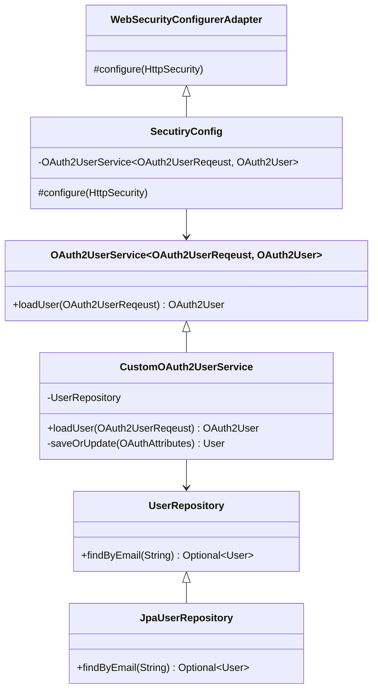
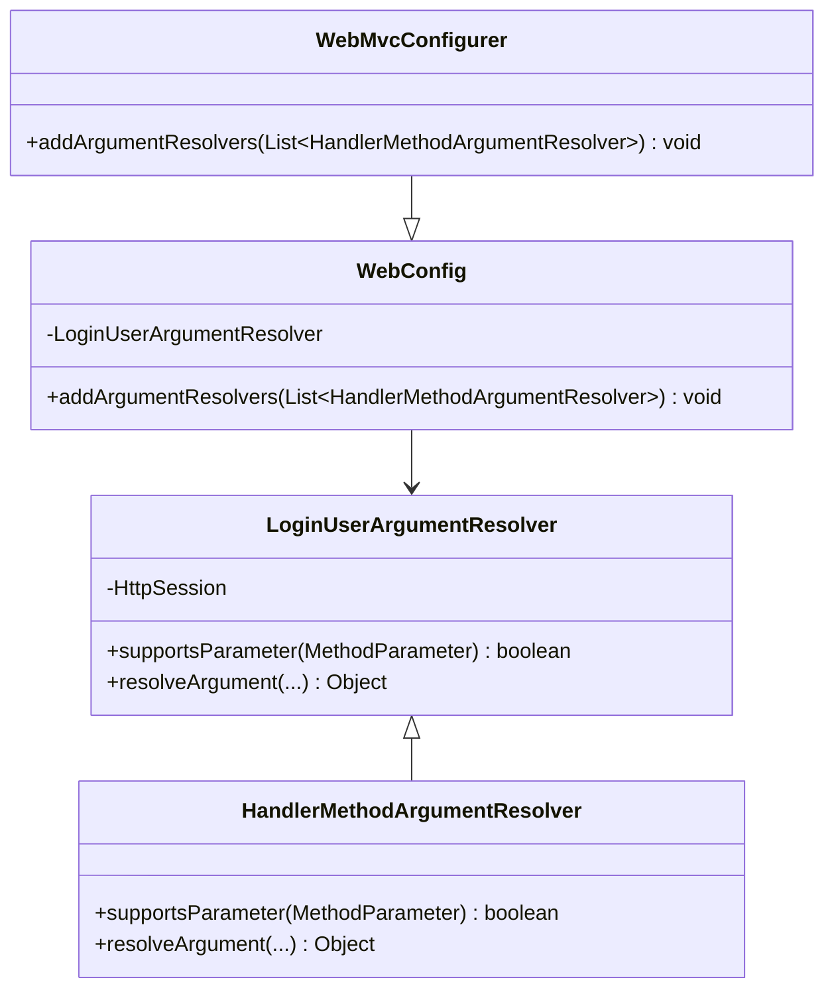

### OAuth2를 활용한 인증 인가 서비스 TDD로 구현
GitHub, Google 에서 제공하는 사용자 정보를 활용해 인증 인가 서비스를 구현합니다. 외부 소셜 로그인이 추가되지 않는 상황을 가정해 OpenID를 키로 활용했습니다.

### 요구 사항

- Oauth2 를 이용해 인증 인가 서비스를 구현합니다.
- 회원가입한 사용자의 정보는 저장합니다.

### 프로그래밍 요구 사항

- 클라이언트와 분리해 서버를 관리합니다.
- 보안을 고려해 클라이언트에 토큰을 노출하지 않습니다.
- 확장성을 고려해 서버 외부에서 서버 상태를 관리합니다.
- TDD로 구현해주세요!

### Skill

- Java

### Version

- `Java 11`
- `Spring Boot 2.7.5`
- `OAuth 2`

### Library

- `spring-boot-starter-oauth2-client`
- `spring-boot-starter-data-jpa`
- `spring-boot-starter-web`
- `spring-session-core`
- `lombok`
- `h2`
- `spring-security-test`
- `spring-boot-starter-test`

### 도메인 모델링

#### 사용자 도메인 모델링
 
- 사용자(`User`)
  - 상태
    - 식별자(`Id`)와 이름(`name`), 이메일(`Email`), 프로필 이미지 경로(`ProfileImagePath`)정보, 권한(`Role`)를 가집니다.
    - 사용자의 권한(`Role`)은 회원(`User`), 관리자(`Admin`) 중 하나의 정보를 가집니다.
  - 행위
    - 사용자의 이름(`name`)과 프로필 이미지 경로(`ProfileImagePath`)를 수정합니다.
    - 사용자의 권한(`Role`)의 식별자를 가져옵니다.
- 권한(`Role`)
  - 상태
    - 식별자(`Key`)와 권한을 표현하는 타이틀(`Title`) 정보를 가집니다.
    - 권한은 회원(`User`)과 관리자(`Admin`) 중 하나로 표현됩니다.

#### User Package 구현

- UserRepository
  - 이메일을 이용해 정보를 조회한다.
- CustomOAuth2UserService
  - 사용자 정보를 조회합니다.
- OAuthAttributes
  - 상태
    - 속성 목록과 속성키, 이름, 이메일, 이미지 경로를 포함합니다.
- SessionUser
  - 상태
    - 이름과 이메일, 이미지 경로를 포함합니다.
    - 직렬화가 가능합니다.

#### Security Package 구현

- SecurityConfig
  - 모든 요청은 인증된 사용자만 요청할 수 있습니다.
  - 특정 URI는 관리자만 허용합니다.
  - 특정 URI는 회원만 허용합니다.
  - 로그아웃을 합니다.
  - 소셜 로그인 성공하면 CustomOAuth2UserService를 활용해 사용자 정보를 저장합니다.

#### global

- LoginUser
  - 상태
    - 애너테이션이며 파라미터에만 등록됩니다.
    - `Runtime`에 동작합니다.
- LoginUserArgumentResolver
  - 컨트롤러 메서드의 특정 파라미터를 지원하는지 판단합니다.
    - `LoginUser` 애너테이션으로 등록된 파라미터인지 확인합니다.
    - `SessionUser` 이어야 합니다.
  - `HttpSession` 에 저장된 `user`를 반환합니다.
- WebConfig
  - `ArgumentResolver`를 등록합니다.

### 클래스 다이어그램

#### 인증 인가 구현

#### 애녀테이션을 활용한 공통 관심사 분리

### 설계하면서 여담

#### 세션 저장소

##### 세션 저장소를 데이터베이스로 결정한 이유

1. 설정이 간단해 시간 절약이 가능합니다.
2. 사용자가 많은 서비스가 아니기 때문에 성능 이슈가 발생하지 않을 거라 판단했습니다.
3. 비용 절감을 위해서입니다.

##### 확장성을 위한 세션 저장소 고려

데이터베이스에서 다른 스토리지로 변경할 수 있도록 Spring Session 라이브러리를 사용했습니다.

#### DTO(Data Transfer Object)

##### 엔티티 클래스의 직렬화를 구현하지 않은 이유

1. 자식 엔티티를 가질 경우 엔티티를 조회할 때 성능이 저하될 수 있습니다.
2. 양방향 매핑으로 인한 순환 참조 등, 부수 효과가 발생할 수 있습니다.

> 직렬화 기능을 가진 DTO를 추가호 만들면 운영 및 유지보수 비용이 절감할 수 있습니다.
